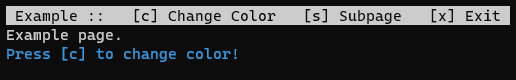

terminal-ui
===========

> A simple framework for creating terminal apps with keyboard control.



**`terminal-ui`** makes it easy to create a terminal application with multiple pages. You can define keyboard commands that perform any kind of tasks. The commands will be displayed at the top menu bar of each page.

For text input you can use this framework together with a prompt runner like [Enquirer](https://www.npmjs.com/package/enquirer) or [Inquirer](https://www.npmjs.com/package/inquirer).

## Install
```
npm i @dmkbn/terminal-ui
```

## Usage

There is a single export called `terminal`. Every page is represented through a function, the Page Initiator.

```js
import terminal from '@dmkbn/terminal-ui'

// Page Initiator of example page
function examplePage() {
  terminal.command('e', 'Exit', () => {
    terminal.exit()
})
  terminal.render(() => {
    return 'Example Page'
  })
}

// Pass all Page Initiators to the terminal 
terminal.initPages([examplePage])
// Start the terminal
terminal.run()
```

## Methods

### initPages
```js
terminal.initPages([example, subpage])
```
Registers all pages of the terminal.

**Parameters:**
* `pageInitiators` - Array of page initiator functions

### run
```js
terminal.run('mainPage')
```
Starts the terminal app.

**Parameters:**
* `startPage` - String name of the page that will be displayed after startup. Default: First page of array provided at `initPages()`.

### render
```js
terminal.render(() => {
  return 'Hello World!'
})
```
Sets the render function. Every Page Initiator needs a render function to define the visual appearance of the page. Whenever a command is executed, the page gets re-rendered.

**Parameters:**
* `fn` - Function that returns a string

### command
```js
terminal.command('e', 'Edit Value', () => {
  value = 5
})
```
Defines a new command. A command is a char that you can type on the keyboard. By default, commands are displayed together with their name in the menu bar (for more, see [menu](#menu)).

**Parameters:**
* `command` - Hotkey that triggers the command (a single char)
* `name` - Name of the command
* `fn` - The function to execute, after the key was pressed. This can also be an async function.

### goTo
```js
terminal.goTo('myPage')
```
Switches to the given page.

**Parameters:**
* `page` - Name of the page

### menu
```js
terminal.menu(['o', 'e', 'x'])
```
Specifies the appearance of the menu bar.

**Parameters:**
* `commands` - An array of commands to display in the mebu bar. They will appear in the same order as they are specified. Setting this to false disables the menu bar.

Disable the menu bar:
```js
terminal.menu(false)
```

### exit
```js
terminal.exit()
```
Closes the terminal.
